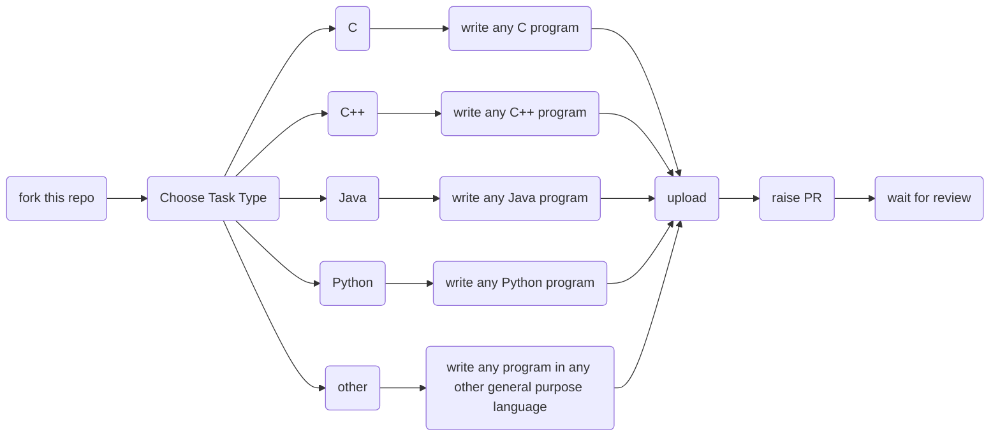

<h1 align="center"> HACKTOBERFEST 2023</h1>

   

   
   
   
   

## Contributors of `Hacktoberfest 2023`

  

# What is Hacktoberfest?

<h3>Hacktoberfest is a program by Digital Ocean, DEV and Github, where you can easily win a T-Shirt just by making 4 pull requests in the month of October to any open source projects on Github.</h3>

# How to participate?

### 1. Register for Hacktoberfest at https://hacktoberfest.com/ or [click here](https://hacktoberfest.com/).
### 2. Fork this repository by clicking the Fork button on the top right corner of this page or simply [click here](https://github.com/sherigar/HacktoberFest-2023/fork).
### 3. Create a new file and **add** a new Program in any programming language like C++, Java, Python, etc. (Note: No duplicate programs can exist!)
### 4. After adding the code, Commit your changes.
### 5. Create a new pull request from your forked repository (Button located at the top of your repository)
### 6. Star this repository

# Note:
### 1. Don't Create Pull Request to update "readme.md" File.
### 2. Upload or Create File in Specified Language Folder.
### 3. If Specified Language Folder not Found then Create Folder and then Upload or Create File.
### 4. Please mention the extention of files while creating them (e.g if file is of java language create file named "xyz.java").

# Example Project/ Ideas for beginners
- Addition of two numbers given by user
- Reversing the string entered by user
- Conversion of a number system to another number system (Decimal, Binary, Hexadecimal, Octal)
- Change the temperature from Celcius to Farenheit
- Find the factorial of a number entered by user
- Find the greatest number among the 5 given numbers by user
- Create the patterns using logic
- Dice Roll Generator - In each execution, a number from 1 to 6 will be printed randomly
- Different types of search algorithms
- Number Guessing Game
- Make calculator without using operators in program

<h1 align="center">For any query or support open an issue.<h1>
